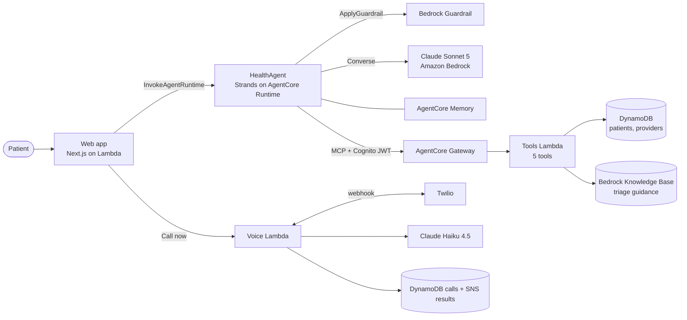

# Health Companion by Shifa

**The right door, not a diagnosis.**

Health Companion is an AI care navigator built for the AWS Agentic AI Hackathon (Future Vision, AWS Summit Dubai 2026), Health Companion track. A patient describes how they feel; the agent works out how urgent it is, checks their own record, and gets them to the right care: a specialist booking, a phone call to the clinic, or emergency services. It never diagnoses, prescribes or suggests doses.

**Live app:** https://wzihykguzzj72v3ptpba2zpgri0psctu.lambda-url.us-west-2.on.aws/en/intake

## What it does

| | |
|---|---|
| **Triage** | Gauges urgency against public triage guidance in a Bedrock Knowledge Base |
| **Red flags** | Sudden worst-ever headache, one-sided weakness, sudden vision loss and similar go straight to emergency services, with no booking |
| **Personal risk** | Reads the patient's history and medications before advising |
| **Booking** | Finds a suitable specialist and books, or phones the clinic with a voice agent |
| **Insurer calls** | The voice agent can call an insurer for pre-approval |
| **Safety boundary** | Bedrock Guardrails check every question before the model sees it; diagnosis, dosing and treatment requests are refused with a safe next step |
| **Bilingual** | English and Arabic, with a right-to-left UI |

Every answer ends with "This is not medical advice."

## Architecture



One patient question, end to end:

1. The web app sends the message and patient id to HealthAgent.
2. The guardrail checks the question. Unsafe requests are refused here and the model is never called.
3. Claude reasons over the request and calls tools through the gateway: patient profile, triage guidance, provider search, booking, visit summary.
4. Red flags end in an emergency instruction. Otherwise the patient gets an urgency level, a specialist suggestion and an offer to book or call.

## Tech stack

| Service | Role |
|---|---|
| Amazon Bedrock | Claude Sonnet 5 (agent), Claude Haiku 4.5 (voice), Guardrails, Knowledge Base |
| Amazon Bedrock AgentCore | Runtime, Gateway, Memory |
| AWS Lambda | Web app, tools, voice calls |
| Amazon DynamoDB | Patients, providers, call records |
| Amazon SNS | Call results |
| Amazon Cognito | Gateway authentication |
| Twilio | Phone line for the voice agent |
| Next.js, next-intl | Web app, English and Arabic |

## Repository layout

```
AgentCoreProject/          HealthAgent: agent code, tools Lambda, tool specs, AgentCore config
  app/HealthAgent/main.py    agent entrypoint (guardrail check, system prompt, gateway tools)
  lambda_functions/health/   tools Lambda
  tool_specs/health.json     tool definitions for the gateway
  agentcore/                 AgentCore CLI project and CDK app
web/                       Shifa web app (Next.js) and its server routes
lambda_functions/call_fulfillment/   voice calling Lambda (Twilio + Bedrock)
tests/, tools/             voice calling tests and call simulators
safety/                    guardrail setup and the 18-prompt safety test suite
infra/                     workshop setup and deploy scripts
```

## Getting started

**Requirements:** Node.js 20+, Python 3.12+, [uv](https://docs.astral.sh/uv/), AWS CLI v2, the [AgentCore CLI](https://www.npmjs.com/package/@aws/agentcore) (`npm install -g @aws/agentcore`).

**Credentials:** put your AWS exports in `.aws-env.sh` at the repository root. It is gitignored.

```bash
export AWS_DEFAULT_REGION="us-west-2"
export AWS_ACCESS_KEY_ID="..."
export AWS_SECRET_ACCESS_KEY="..."
export AWS_SESSION_TOKEN="..."
```

### Run the web app locally

```bash
cd web
./start-local.sh          # http://localhost:3000/en/intake
```

### Deploy

```bash
source .aws-env.sh

# Agent, tools, gateway and memory (first time in a new account)
bash infra/workshop-setup.sh
# If CDK bootstrap fails because the account can't create cdk-* roles:
bash infra/fix-deploy.sh

# Redeploy the agent after a change
cd AgentCoreProject && agentcore deploy -y

# Web app to Lambda with a public URL
cd web && ./deploy-lambda.sh

# Voice calling Lambda
./lambda_functions/call_fulfillment/deploy.sh
```

The voice service needs Twilio settings in SSM under `/app/workshop/shifa/twilio/`. See `lambda_functions/call_fulfillment/README.md`.

`AgentCoreProject/agentcore/agentcore.json` holds the gateway client secret locally. Git skips that file (`git update-index --skip-worktree`), so the committed copy keeps a placeholder.

## Safety testing

```bash
uv run safety/guardrail_check.py              # the 18 prompts against the guardrail alone
uv run safety/guardrail_update.py             # preview guardrail changes (add --apply to save)
uv run safety/run_tests.py                    # the 18 prompts end to end against the agent
```

The suite covers normal questions, red flags, refusals and trick prompts. The guardrail alone currently passes 17 of 18; the one miss over-blocks "I take blood pressure medication", which the agent handles by reading medications from the patient record.

## Data and privacy

The demo uses synthetic patients. Patient fields are never logged, tools are read-only except booking, each service has a least-privilege IAM role, AWS credentials stay server-side, and call records expire after 7 days. A production deployment would run in the AWS UAE region under the UAE Personal Data Protection Law (Federal Decree-Law No. 45 of 2021), with consent capture and salted hashing of identifiers.

## Roadmap

- Emirates ID reading with Amazon Textract and form pre-fill
- Pre-filled hospital intake forms from the conversation
- Live insurer eligibility checks and plan guidance
- Status updates by WhatsApp, SMS or email
- Production hosting in the AWS UAE region

## Disclaimer

Health Companion is a hackathon prototype. It does not provide medical advice, diagnosis or treatment. In an emergency, call your local emergency number.
